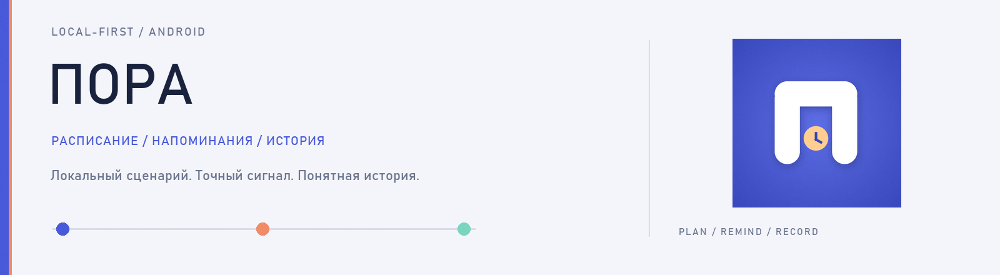
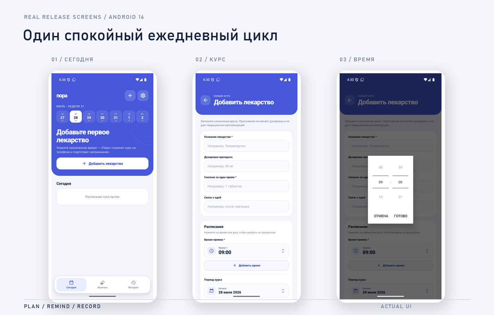

<p align="center">
  
</p>

# Пора

**Local-first Android-приложение для расписания лекарств, точных напоминаний и истории приёмов.** Основной сценарий работает без аккаунта и без сервера; аккаунт нужен только для резервной копии и синхронизации.

<p align="center"><a href="https://github.com/pavel-logachev/pora/releases/latest"><strong>Android 1.0.2</strong></a> &nbsp;·&nbsp; <a href="https://github.com/pavel-logachev/pora/actions">CI</a> &nbsp;·&nbsp; Android 7+ &nbsp;·&nbsp; <a href="LICENSE">MIT</a></p>

<p align="center">
  
</p>

> **Status:** independent signed Android release candidate. APK прошёл emulator acceptance и проверку подписи; финальная проверка уведомлений после reboot и при выключенном экране на физическом OEM-устройстве остаётся обязательной перед массовой раздачей.

## Что решает продукт

«Пора» хранит назначения локально и помогает пройти короткий ежедневный цикл без лишних экранов:

```text
создать курс → получить точное уведомление → отметить приём или пропуск → увидеть историю
```

Приложение не назначает лечение, не проверяет совместимость препаратов и не заменяет врача или инструкцию.

## Реализовано

- локальная SQLite-база и полноценная работа без аккаунта;
- несколько приёмов в сутки и необязательная дата окончания курса;
- нативные Android spinner-пикеры времени и даты;
- точные Android alarms, восстановление расписания после reboot и пересчёт при смене timezone;
- действия из уведомления: принять или пропустить;
- история событий и экспорт;
- контроль остатка лекарства;
- optional account sync с token rotation, recovery code и удалением аккаунта;
- Argon2id для паролей, hashed recovery/refresh tokens и HTTPS;
- accessibility labels и увеличенные touch targets.

## Установка

1. Откройте [последний GitHub Release](https://github.com/pavel-logachev/pora/releases/latest).
2. Скачайте `Pora-1.0.2-android.apk` и файл `.sha256` рядом с ним.
3. Разрешите установку приложений из выбранного источника, если Android запросит это.
4. В настройках «Поры» разрешите уведомления и точные будильники.
5. На Xiaomi, Samsung и Huawei дополнительно проверьте ограничения батареи.

- Package ID: `net.logachev.pora`
- Version: `1.0.2 (3)`
- Minimum: Android 7.0 / API 24
- Target: Android 16 / API 36
- Signing certificate SHA-256: `84896805b83fb7c8bae0ceefaea0a450deca5bc3a2de5ebb67f1a4c3c5c1469c`
- APK SHA-256: `e9003508124ac501dc0ac2519dd075e5a01bb2eff2f880ac79edb9d7337d02a9`

Полные release notes и acceptance evidence: [docs/release/RELEASE_NOTES_1.0.2.md](docs/release/RELEASE_NOTES_1.0.2.md).

## Архитектура

```text
React Native / Expo app
  ├─ domain model
  ├─ SQLite repository
  ├─ notification planner + reconciler
  ├─ native Android exact-alarm module
  ├─ secure session store
  └─ optional sync client
           ↓ HTTPS
Fastify API
  ├─ Argon2id auth + JWT rotation
  ├─ idempotent event stream
  └─ PostgreSQL
```

Подробности: [docs/ARCHITECTURE.md](docs/ARCHITECTURE.md).

## Запуск приложения из исходников

Требования: Node.js 24, npm, Android SDK и JDK 21.

```bash
npm ci
npm run typecheck
npm test -- --runInBand
npx expo-doctor
npm run android
```

Для web preview:

```bash
npm run web
```

## Запуск API

```bash
cd backend
cp .env.example .env
npm ci
npm run migrate
npm run dev
```

Нужны PostgreSQL и собственный `JWT_SECRET` длиной не менее 32 символов. Production secrets в репозитории отсутствуют.

## Проверка

На текущей release-линии подтверждены:

- mobile: 18 Jest suites / 37 tests, TypeScript и Expo Doctor 20/20;
- backend: 2 Vitest suites / 8 tests, TypeScript и production build;
- signed APK: package metadata `1.0.2 (3)`, APK Signature Scheme v2 и сертификат RSA 3072;
- clean install и update install на Android 16 emulator;
- Exact Alarm в forced deep Doze, действия уведомлений и восстановление после reboot;
- нативные time/date pickers, несколько приёмов в сутки и отмена незавершённого выбора;
- production `/health`, privacy и terms endpoints.

## Структура

```text
src/                     mobile domain, data, UI, notifications and sync
modules/pora-device-settings/
                         native Android exact-alarm integration
backend/                 Fastify/PostgreSQL sync service
scripts/                 explicit production smoke test
docs/                    architecture, screenshots and release evidence
```

## Приватность и безопасность

- локальные функции не требуют аккаунта;
- аудио, реклама и рекламное профилирование отсутствуют;
- серверная синхронизация включается только после создания аккаунта;
- аккаунт и серверную копию можно удалить из приложения;
- секреты подписи APK и production credentials не входят в репозиторий.

- Политика: https://pora.194-87-101-107.sslip.io/legal/privacy
- Условия: https://pora.194-87-101-107.sslip.io/legal/terms
Security policy: [SECURITY.md](SECURITY.md)

## Ограничения

- release не опубликован в Google Play;
- iOS target описан в Expo config, но iOS build и acceptance не подтверждены;
- доставка уведомлений зависит от OEM-настроек батареи;
- приложение не является медицинским изделием.

## Лицензия

Код проекта — [MIT](LICENSE). Сторонние компоненты сохраняют собственные лицензии; см. [THIRD_PARTY_NOTICES.md](THIRD_PARTY_NOTICES.md).
