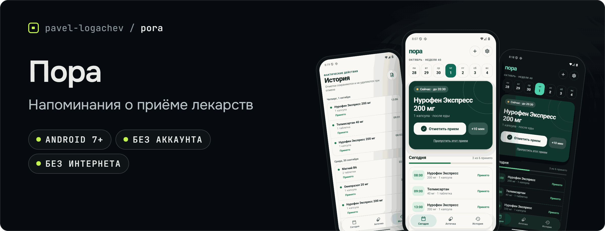

<picture><source media="(max-width: 767px)" srcset="docs/assets/pora-banner-mobile.png"></picture>

# Пора

**Напоминания о приёме лекарств, история и остатки — на Android, без аккаунта и интернета.**

[Скачать APK 1.1.0](https://github.com/pavel-logachev/pora/releases/tag/v1.1.0) · [Что умеет](#что-умеет) · [Приватность](#приватность-и-безопасность) · [Как устроено](#как-устроено)

Для тех, кто принимает лекарства по расписанию или помогает близким. Внесите назначенный врачом курс, укажите время и отмечайте приёмы — в приложении или прямо из уведомления. Аккаунт нужен только для резервной копии и синхронизации между устройствами.

## Что умеет

- **Вести расписание.** Несколько приёмов в сутки, необязательная дата окончания курса, отметки «до / во время / после еды».
- **Напоминать и принимать отметки.** Точные будильники Android; приём или пропуск можно отметить прямо из уведомления.
- **Показывать историю.** Ближайший приём и прогресс дня на экране «Сегодня», история отметок и экспорт в CSV.
- **Учитывать остатки.** В аптечке видно, сколько лекарства осталось.
- **Находить лекарства без интернета.** Встроенный справочник ЕСКЛП Минздрава России: 23 001 препарат, редакция от 29.07.2026. Поиск по названию и действующему веществу, подстановка дозировки и формы. Название можно ввести вручную.
- **Подстраиваться под тему телефона.** Светлая и тёмная тема, крупные шрифты и зоны нажатия, подписи для специальных возможностей.


*Экраны «Поры»: история, поиск лекарства и аптечка.*

## Установка

Релиз **1.1.0**. Минимальная версия — **Android 7.0 / API 24**.

1. Откройте [страницу релиза 1.1.0](https://github.com/pavel-logachev/pora/releases/tag/v1.1.0).
2. Скачайте `Pora-1.1.0-android.apk` и лежащий рядом файл `.sha256`.
3. Если Android попросит, разрешите установку приложений из этого источника.
4. В настройках «Поры» разрешите уведомления и точные будильники.
5. На Xiaomi, Samsung и Huawei дополнительно проверьте ограничения батареи для приложения, иначе уведомления могут задерживаться.

### Если установлена версия 1.0.x

**Сначала сохраните данные.** Ключ подписи 1.0.x утрачен. Версия 1.1.0 подписана новым ключом и не установится поверх старой — приложение нужно удалить и поставить заново.

Перед удалением войдите в аккаунт «Пора» и дождитесь «Данные синхронизированы». После установки 1.1.0 войдите в тот же аккаунт: курсы, расписание и история вернутся, напоминания пересоздадутся. Историю также можно выгрузить в CSV через «Настройки → Экспорт».

**Данные без аккаунта хранятся только на телефоне и при удалении приложения пропадут.**

Пакет — `net.logachev.pora`, версия APK — `1.1.0 (6)`. SHA-256 APK и сертификата подписи опубликованы в [заметках к релизу](<docs/release/RELEASE_NOTES_1.1.0.md>).

## Приватность и безопасность

- **Без аккаунта данные остаются на телефоне.** Курсы, расписания и история хранятся локально. Напоминания и поиск в справочнике не зависят от сервера.
- **Синхронизация необязательна.** При её использовании названия лекарств, расписания, остатки и история передаются на сервер по HTTPS. **Сквозного шифрования нет:** HTTPS защищает данные при передаче.
- **Учётные данные защищены отдельно.** Пароли хешируются Argon2id; код восстановления и refresh-токены хранятся на сервере только в виде хешей. Токены сессии на Android — в защищённом хранилище платформы.
- **Аккаунт можно удалить из приложения.** Удаляются учётная запись и серверная копия; локальные данные остаются на телефоне.
- **Нет рекламы и рекламного профилирования.** Приложение не записывает звук; разрешения на общее хранилище телефона заблокированы.

Ключи подписи APK и рабочие учётные данные в репозиторий не входят. Об уязвимостях сообщайте приватно — порядок описан в [политике безопасности](<SECURITY.md>).

[Политика конфиденциальности](https://pora.194-87-101-107.sslip.io/legal/privacy) · [Условия использования](https://pora.194-87-101-107.sslip.io/legal/terms)

## Как устроено

Приложение написано на **React Native и Expo**. Курсы и события хранятся в локальной **SQLite**; справочник ЕСКЛП поставляется отдельной SQLite-базой с полнотекстовым поиском FTS5.

Напоминания планируются на устройстве. Нативный модуль Android отвечает за точные будильники и восстановление расписания после перезагрузки; при смене часового пояса расписание пересчитывается.

Необязательный сервер на **Fastify и PostgreSQL** синхронизирует события между устройствами. Недоступность API не удаляет локальное расписание и не мешает записывать приёмы.

Подробнее — [архитектура и модель доверия](<docs/ARCHITECTURE.md>).

## Запуск из исходников и проверка

Нужны **Node.js 24**, npm, Android SDK и **JDK 21**. Из корня репозитория:

```bash
npm ci
npm run typecheck
npm test -- --runInBand
npx expo-doctor
npm run android
```

Предпросмотр в браузере: `npm run web`.

### Подписанная релизная сборка

Ключ и пароли берутся из каталога вне репозитория. Требования к ним описаны в заголовке [скрипта сборки](<scripts/build-android-release.py>).

```bash
python scripts/build-android-release.py
```

### Сервер синхронизации

Для собственного сервера нужны PostgreSQL и собственный `JWT_SECRET` длиной не меньше 32 символов. Рабочих секретов в репозитории нет.

```bash
cd backend
cp .env.example .env
npm ci
npm run migrate
npm run dev
```

Проверки сервера — в отдельном терминале, из каталога [backend](<backend/>):

```bash
npm run typecheck
npm test
npm run build
```

### Что проверено

В [заметках к релизу 1.1.0](<docs/release/RELEASE_NOTES_1.1.0.md>) зафиксированы 21 набор Jest, 78 тестов, проверка TypeScript и Expo Doctor 21/21. Подписанный APK проверен через `apksigner verify`, установлен и запущен на эмуляторе Android 16; проверены справочник, светлая и тёмная тема.

[CI](https://github.com/pavel-logachev/pora/actions) при каждом push и pull request в `main` проверяет типы, тесты и Expo Doctor приложения, а также типы, тесты и сборку сервера.

## Структура

- [src/](<src/>) — домен, данные, справочник, интерфейс, уведомления и синхронизация приложения.
- [modules/pora-device-settings/](<modules/pora-device-settings/>) — нативная интеграция точных будильников Android.
- [backend/](<backend/>) — сервис синхронизации на Fastify и PostgreSQL.
- [scripts/](<scripts/>) — сборка APK и проверка рабочего сервиса.
- [docs/](<docs/>) — архитектура, скриншоты и сведения о релизах.

## Ограничения

- **Установка только из APK.** Приложения нет в Google Play. iOS указан в настройках Expo, но сборка и приёмка для iOS не проверены.
- **Уведомления зависят от настроек Android.** Ограничения батареи в оболочке производителя могут задерживать напоминания.
- **Проверки 1.1.0 не охватывают все условия.** На этом релизе не проверялись физический телефон, доставка уведомлений в Doze, после перезагрузки и на конкретных оболочках Android. Проверки Doze и восстановления после перезагрузки относятся к 1.0.2; код этой части не менялся.
- **Приложение не назначает лечение.** «Пора» не является медицинским изделием, не проверяет рецепты и взаимодействия препаратов, не заменяет врача или инструкцию к лекарству.

## Лицензия

Автор — **Павел Логачев**. Код проекта распространяется по [MIT](<LICENSE>). Сторонние компоненты сохраняют собственные лицензии — см. [THIRD_PARTY_NOTICES.md](<THIRD_PARTY_NOTICES.md>).
