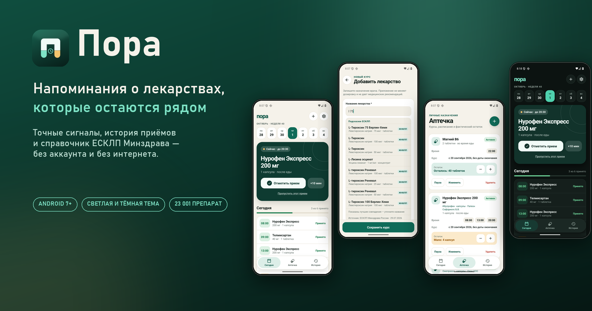
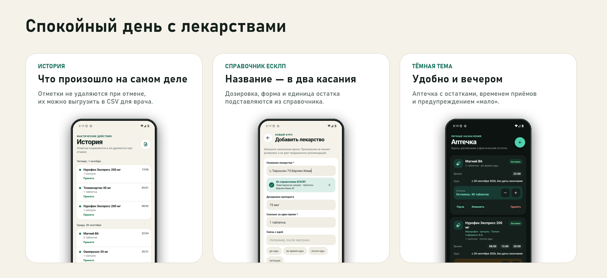

<p align="center">
  
</p>

# Пора

**Android-приложение для расписания лекарств, точных напоминаний и истории приёмов, где данные хранятся на телефоне.** Основной сценарий работает без аккаунта и без сервера; аккаунт нужен только для резервной копии и синхронизации.

<p align="center"><a href="https://github.com/pavel-logachev/pora/releases/tag/v1.1.0"><strong>Android 1.1.0</strong></a> &nbsp;·&nbsp; <a href="https://github.com/pavel-logachev/pora/actions">CI</a> &nbsp;·&nbsp; Android 7+ &nbsp;·&nbsp; <a href="LICENSE">MIT</a></p>

<p align="center">
  
</p>

> **Статус:** Android-релиз 1.1.0 — справочник лекарств ЕСКЛП и новый дизайн. APK подписан **новым** ключом (ключ 1.0.x утрачен), поэтому поверх 1.0.x он не ставится: см. «Установка». В Google Play приложение не опубликовано.

## Что решает продукт

«Пора» хранит назначения локально и помогает пройти короткий ежедневный цикл без лишних экранов:

1. Создать курс.
2. Получить точное уведомление.
3. Отметить приём или пропуск.
4. Увидеть результат в истории.

Приложение не назначает лечение, не проверяет совместимость препаратов и не заменяет врача или инструкцию.

## Реализовано

- локальная SQLite-база и полноценная работа без аккаунта;
- несколько приёмов в сутки и необязательная дата окончания курса;
- системные «барабаны» выбора времени и даты Android;
- точные будильники Android, восстановление расписания после перезагрузки и пересчёт при смене часового пояса;
- действия из уведомления: принять или пропустить;
- история событий и экспорт;
- контроль остатка лекарства;
- офлайн-справочник лекарств ЕСКЛП Минздрава России (23 001 препарат): подсказки по названию и действующему веществу, дозировка, форма, ЖНВЛП;
- светлая и тёмная тема по настройке системы;
- необязательная синхронизация аккаунта с ротацией токенов, кодом восстановления и удалением аккаунта;
- Argon2id для паролей, хеши кода восстановления и refresh-токенов, HTTPS;
- подписи для специальных возможностей и увеличенные зоны нажатия.

## Установка

1. Откройте [страницу релиза 1.1.0](https://github.com/pavel-logachev/pora/releases/tag/v1.1.0).
2. Скачайте `Pora-1.1.0-android.apk` и файл `.sha256` рядом с ним.
3. Разрешите установку приложений из выбранного источника, если Android запросит это.
4. В настройках «Поры» разрешите уведомления и точные будильники.
5. На Xiaomi, Samsung и Huawei дополнительно проверьте ограничения батареи.

> **Обновление с 1.0.x.** Ключ подписи 1.0.x утрачен, поэтому 1.1.0 нужно ставить заново, а не поверх. Перед удалением старой версии войдите в аккаунт «Пора» и дождитесь синхронизации (или выгрузите историю в CSV): после установки курсы вернутся из аккаунта. Данные без аккаунта хранятся только на телефоне. Подробности — в [заметках к релизу](docs/release/RELEASE_NOTES_1.1.0.md).

- Идентификатор пакета: `net.logachev.pora`
- Версия: `1.1.0 (6)`
- Минимум: Android 7.0 / API 24
- Целевая версия: Android 16 / API 36
- SHA-256 сертификата подписи: `b614b5a5af9fde7264c5f42788e51648b6f66ff2473289333d2258d5fb9d510f`
- SHA-256 APK: `a7c707776651ec21a12e48033b8f08042725fd36e18d0676fe181efd116a522d`

Полные заметки к релизу: [docs/release/RELEASE_NOTES_1.1.0.md](docs/release/RELEASE_NOTES_1.1.0.md). Предыдущий релиз: [1.0.2](docs/release/RELEASE_NOTES_1.0.2.md). Как была восстановлена версия 1.0.4 со справочником: [docs/RECOVERY_1_0_4.md](docs/RECOVERY_1_0_4.md).

## Архитектура

**Приложение на React Native / Expo**

- доменная модель и репозиторий SQLite;
- справочник ЕСКЛП: встроенная SQLite-база с полнотекстовым поиском (FTS5), проверка версии и размера при открытии;
- единая тема (светлая и тёмная) в `src/ui/theme.ts`;
- планировщик уведомлений и сверка расписания;
- нативный модуль точных будильников Android;
- защищённое хранилище сессий;
- необязательный клиент синхронизации через HTTPS.

**API на Fastify**

- аутентификация Argon2id и ротация JWT;
- идемпотентный поток событий;
- PostgreSQL.

Подробности: [docs/ARCHITECTURE.md](docs/ARCHITECTURE.md).

## Запуск приложения из исходников

Требования: Node.js 24, npm, Android SDK и JDK 21.

```bash
npm ci
npm run typecheck
npm test -- --runInBand
npx expo-doctor
npm run android
```

Подписанная релизная сборка (ключ и пароль берутся из каталога вне репозитория, см. заголовок скрипта):

```bash
python scripts/build-android-release.py
```

Предпросмотр в браузере:

```bash
npm run web
```

## Запуск API

```bash
cd backend
cp .env.example .env
npm ci
npm run migrate
npm run dev
```

Нужны PostgreSQL и собственный `JWT_SECRET` длиной не менее 32 символов. Рабочих секретов в репозитории нет.

## Проверка

Для 1.1.0 подтверждены:

- приложение: 21 набор Jest / 78 тестов (включая поиск по реальному файлу справочника и миграции), TypeScript и Expo Doctor 21/21;
- подписанный APK 1.1.0 (6): `apksigner verify`, APK Signature Scheme v2, RSA 3072, установка и запуск на эмуляторе Android 16, светлая и тёмная тема;

Для линии релизов 1.0.2 (код уведомлений с тех пор не менялся) ранее подтверждены:

- приложение: 18 наборов Jest / 37 тестов, TypeScript и Expo Doctor 20/20;
- сервер: 2 набора Vitest / 8 тестов, TypeScript и рабочая сборка;
- подписанный APK 1.0.2 (3): APK Signature Scheme v2 и сертификат RSA 3072;
- чистая установка и обновление на эмуляторе Android 16;
- точные будильники в принудительном глубоком Doze, действия уведомлений и восстановление после перезагрузки;
- системные выбор времени и даты, несколько приёмов в сутки и отмена незавершённого выбора;
- рабочие `/health`, страницы конфиденциальности и условий.

## Структура

- `src/` — домен, данные, справочник, интерфейс, уведомления и синхронизация приложения;
- `modules/pora-device-settings/` — нативная интеграция точных будильников Android;
- `backend/` — сервис синхронизации на Fastify и PostgreSQL;
- `scripts/` — проверка рабочего сервиса и `build-android-release.py` (подписанная сборка; ключ лежит вне репозитория);
- `docs/` — архитектура, скриншоты и подтверждения релизов.

## Приватность и безопасность

- локальные функции не требуют аккаунта;
- аудио, реклама и рекламное профилирование отсутствуют;
- серверная синхронизация включается только после создания аккаунта;
- аккаунт и серверную копию можно удалить из приложения;
- секреты подписи APK и рабочие учётные данные не входят в репозиторий; справочник ЕСКЛП только подсказывает названия и не отправляется на сервер.

- Политика конфиденциальности: https://pora.194-87-101-107.sslip.io/legal/privacy
- Условия: https://pora.194-87-101-107.sslip.io/legal/terms
- Политика безопасности: [SECURITY.md](SECURITY.md)

## Ограничения

- приложение не опубликовано в Google Play;
- iOS указан в настройках Expo, но сборка и приёмка для iOS не подтверждены;
- доставка уведомлений зависит от OEM-настроек батареи;
- приложение не является медицинским изделием.

## Лицензия

Код проекта — [MIT](LICENSE). Сторонние компоненты сохраняют собственные лицензии; см. [THIRD_PARTY_NOTICES.md](THIRD_PARTY_NOTICES.md).
